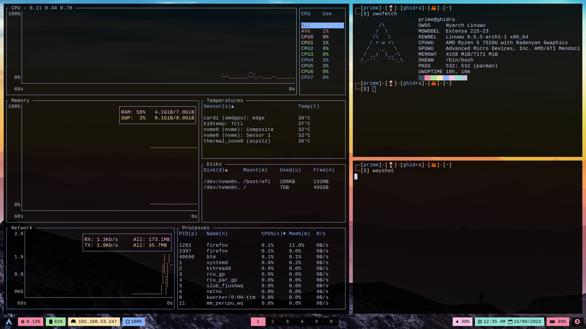

# river_candy

This repository holds the dot configs for the RiverWM config along with other applications to make it eye candy!

The following packages are used to make Arch linux complete setup with Only Wayland and Pipewire.


#### The Pipewire Stuff

```bash
sudo pacman -Sy pipewire alsa-utils pipewire-alsa pamixer
```

### The RiverWM (Wayland) Stuff
```bash
sudo pacman -Sy wayland wayland-protocols libevdev libxkbcommon pixman scdoc wlroots foot waybar wofi mako eza bat imv mpv wayshot
```

```bash
paru wbg // for wallpaper 
```

## Finally 

And just copy and paste these config files over to your CONFIG_HOME directory:

```bash
cp -r ./* $HOME/.config
```

## And you are all set up!


